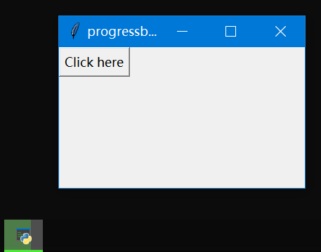

# Easy Taskbar Progress

Windows 下的超简单的工具栏进度条 DLL。可嵌入任意 GUI 程序。



大量参考了 [Shane 的博客](http://shanekirk.com/2014/12/making-progress-on-the-windows-taskbar/)。

> 本项目也是作为学习 GitHub Actions 和 CMake 的学习材料。作者也是通过学习创建了此项目。

- [Easy Taskbar Progress](#easy-taskbar-progress)
  - [编译](#编译)
  - [导出 ABI](#导出-abi)
  - [测试效果](#测试效果)
  - [开源协议](#开源协议)

## 编译

你可以在 Release 中直接下载 DLL。

```bash
cmake -B ./build -G "Visual Studio 16 2019" -T host=x64 -A x64 .
cmake --build ./build --config Release --target ALL_BUILD -j 4 --
```

其中 `-G "Visual Studio 16 2019"` 要指定为你的 VS 版本。

如果 VS 配置正确将生成 `.\build\build\Release\easy-taskbar-progress.dll`。

## 导出 ABI

这些接口都默认没有返回值。

| 接口                              | 功能                             |
| --------------------------------- | -------------------------------- |
| `init()`                          | 开始进度条功能                   |
| `set_value(int value, int total)` | 设置值，最终表示为 `value/total` |
| `end()`                           | 结束进度条功能                   |

**注意**：`init()` 的时间节点决定了它内部保存的窗口句柄（`HWND`），只有当程序运行在包含窗口事件循环的时候，`init()` 才能正确初始化为当前激活窗口。

## 测试效果

Python >= 3.7

```bash
python tests/main.py
```

每次点击，进度条都会加 10%，然后循环。

## 开源协议

MIT.
